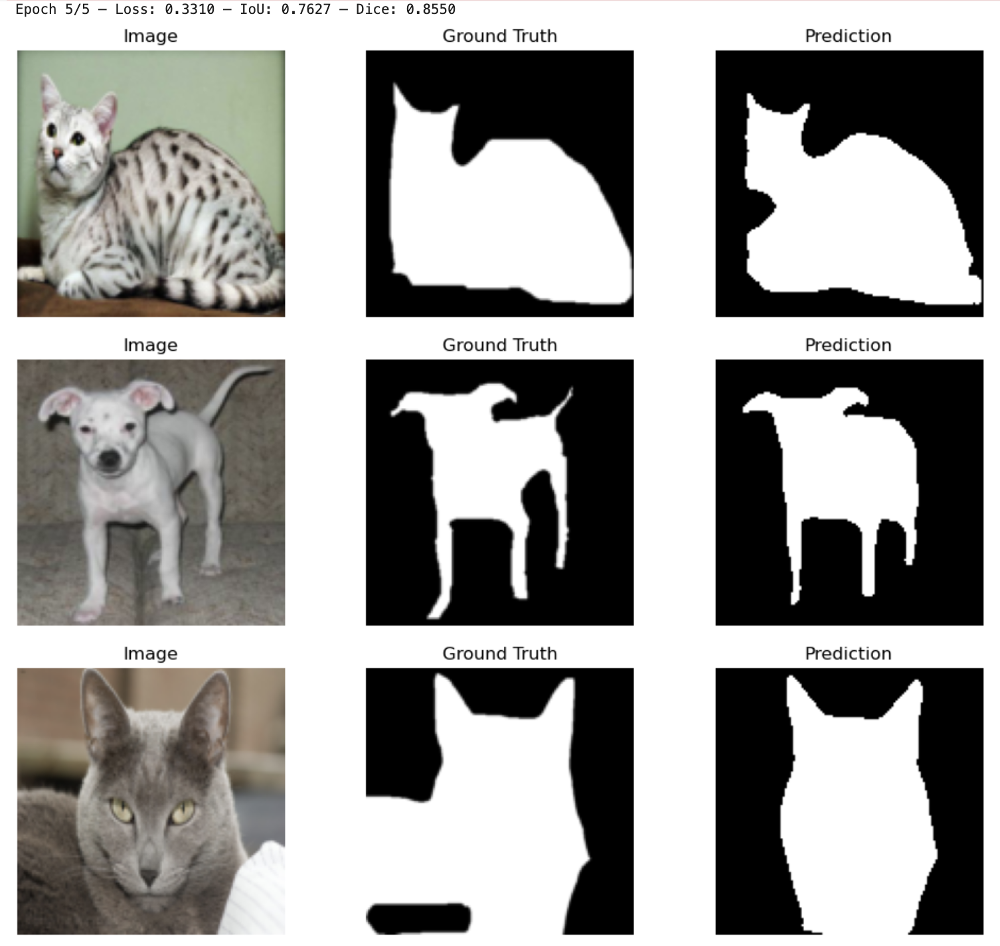

# Лабораторные работы по дисциплине "Методы, средства и технологии мультимедиа"
**Студент:** Шуленков Илья  
**Группа:** М8О-406Б-21  
 

# ЛР7 Семантическая сегментация 
Датасет: [The Oxford-IIIT Pet Dataset](https://www.robots.ox.ac.uk/~vgg/data/pets/)  
| Модель                     | IoU   | Dice  |
|----------------------------|-------|-------|
| Бейзлайн                   | 0.7301| 0.8297|
| Улучшенный бейзлайн        | 0.7627| 0.8550|
| Самостоятельная реализация | 0.4765| 0.6322|

**Вывод:** улучшенный бейзлайн показал наилучший результат, улучшив метрики обычного бейзлана на ~4%, за счёт использования расширенных аугментаций и оптимизированных гиперпараметров. 

**Пример лучшего результата:** 

# ЛР8 Обнаружение и распознавание объектов
Датасет: [Coco128](https://www.kaggle.com/datasets/ultralytics/coco128)  
| Модель                     | mAP50 | mAP50-95 |
|----------------------------|-------|----------|
| Бейзлайн                   | 0.8332| 0.6756   |
| Улучшенный бейзлайн        | 0.8078| 0.6209   |
| Самостоятельная реализация |       |          |

